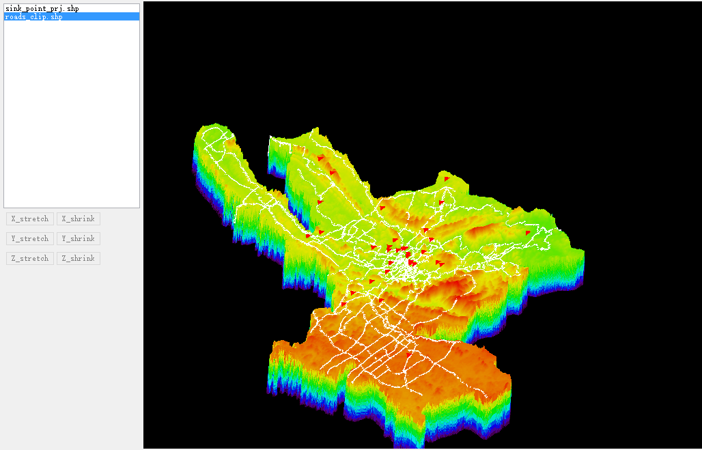

Visualization of 3D Geographical Model
======================

This is one of my demo programs during my internship in the the **Lab of GIS and Remote sensing** in **Beijing Normal University**.It is used to visualize the topography.Users can also add different shapefiles(e.g. roads,sink points,etc.) to the 3D geographical model. This program is implemented with IDL.

 

